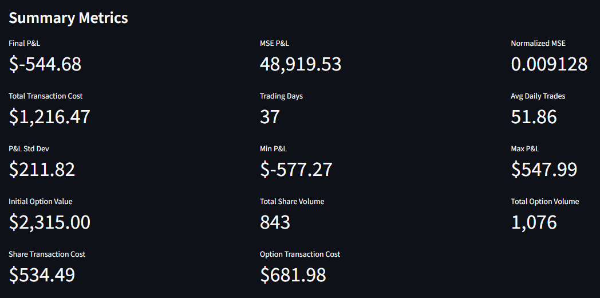
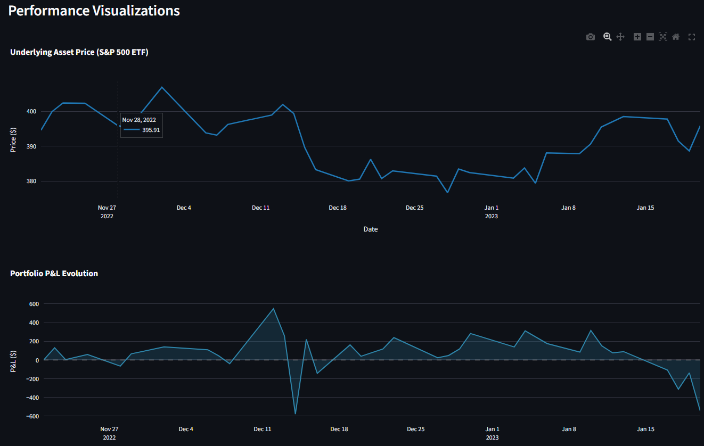
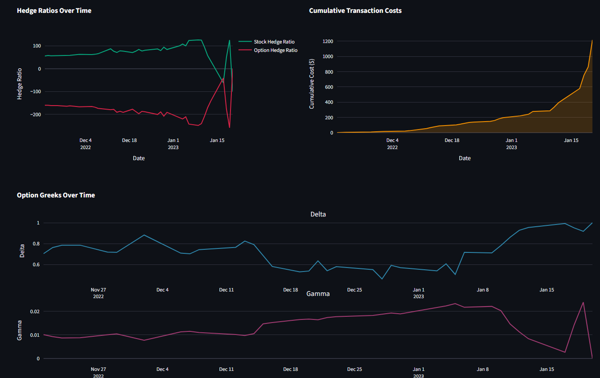
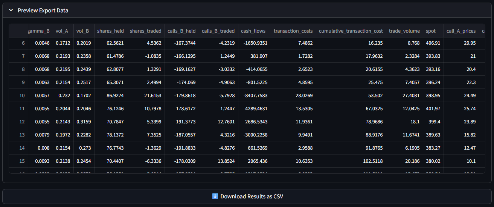
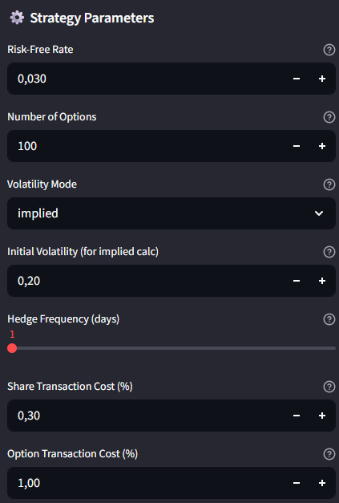

# Options Hedging Tool/Dashboard

A **Delta and Delta-Gamma hedging simulation tool** for S&P 500 ETF call options with an interactive Streamlit dashboard. Backtest dynamic hedging strategies, analyze risk metrics, and compare performance across market conditions.

## Overview

Implements dynamic hedging strategies used by investment banks and market makers to manage derivatives exposure:

- **Delta Hedging**: Neutralize first-order price risk using underlying shares
- **Delta-Gamma Hedging**: Simultaneous delta and gamma neutrality using options and shares

## Dashboard

**Summary Metrics**



**Performance Analysis**



**Advanced Analytics**



**Results Export**



**Configuration Panel**



## Key Features

- **Customizable Parameters**: Volatility mode (constant/implied), hedge frequency, transaction costs, date ranges
- **Comprehensive Metrics**: P&L tracking, MSE analysis, Greeks evolution, transaction cost breakdown
- **Interactive Visualizations**: Portfolio dynamics, hedge ratios, underlying price movements
- **Data Export**: Complete time series results exportable as CSV
- **Extensible Framework**: Add custom strategies in `strategies.py`, integrate new data via `market_2023/` folder

## Quick Start

```bash
# Install dependencies
uv sync

# Run dashboard
streamlit run app/main.py
```

Dashboard opens at `http://localhost:8501`

## Project Structure

```
options-hedging/
├── app/
│   ├── main.py              # Streamlit dashboard
│   ├── strategies.py        # Hedging implementations
│   ├── pricing.py           # Black-Scholes & Greeks
│   ├── runner.py            # Execution wrappers
│   ├── data_loader.py       # Data management
│   └── visualizations.py    # Plotly charts
├── market_2023/             # Option data (12 maturities)
└── notebook/                # Jupyter analysis
```

## Use Cases

**Portfolio Managers**: Backtest strategies across market conditions, optimize hedge frequency vs. costs

**Quantitative Analysts**: Analyze hedge dynamics, Greeks behavior, MSE distributions, volatility impact

**Risk Managers**: Assess residual risk, quantify transaction costs, validate hedging models

## Technical Implementation

### Hedging Strategies

**Delta Hedging** (`run_delta_hedge`): Maintains delta-neutral portfolio by holding Δ × N shares. Minimizes first-order price risk through dynamic rebalancing.

**Delta-Gamma Hedging** (`run_gamma_hedge`): Achieves delta and gamma neutrality using primary option, hedge option, and underlying shares. Solves linear system for simultaneous neutrality.

### Pricing Models

**Implied Volatility**: Newton-Raphson method with convergence safeguards
```python
σ_implied = calc_volatility_newton(C, S, E, t, r, σ_initial)
```

**Greeks**: Numerical integration via scipy
```python
Δ = N(d₁)
Γ = N'(d₁) / (S × σ × √t)
```

## Data Format

Apache Feather format with schema:

| Column | Type | Description |
|--------|------|-------------|
| `Date` | datetime | Trading date |
| `Underlying` | float | S&P 500 ETF price |
| `C{strike}` | float | Call price at strike |

File naming: `SPY.P{YYYY-MM-DD}.feather`

## Extending the Tool

**Add a Custom Strategy** in `app/strategies.py`:

```python
def run_vega_hedge(data, strike, config, start_date=None, end_date=None):
    """Custom vega hedging implementation."""
    # Your strategy logic
    return {
        'dates': [...],
        'pnl': [...],
        # Your metrics
    }
```

Then create execution wrapper in `app/runner.py` and add UI controls in `app/main.py`.

**Add Custom Data**:
1. Place feather files in `market_2023/` folder
2. Follow naming: `SPY.P2023-{MM}-{DD}.feather`
3. Include columns: `Date`, `Underlying`, `C{strike}`
4. Dashboard auto-detects on restart


## License

Available for educational and portfolio purposes.
